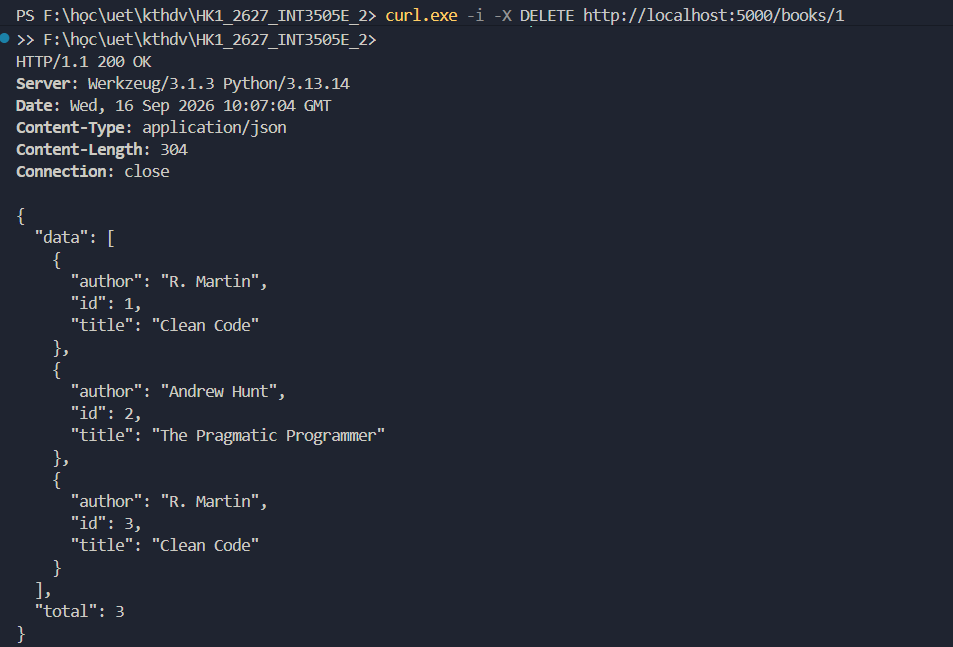
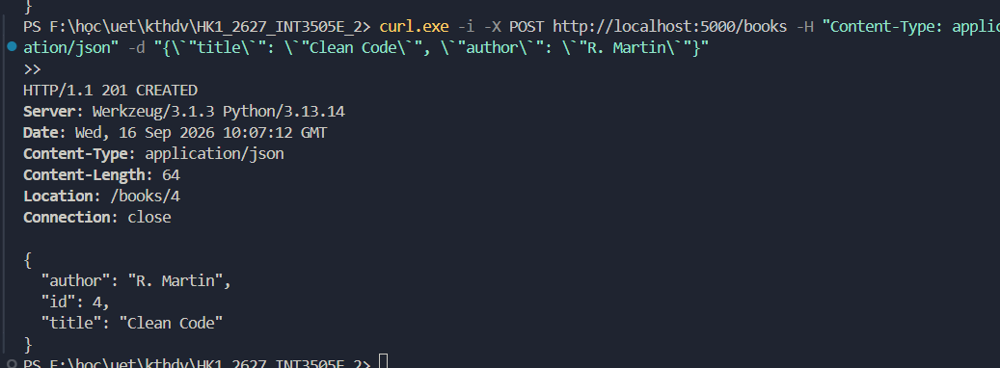
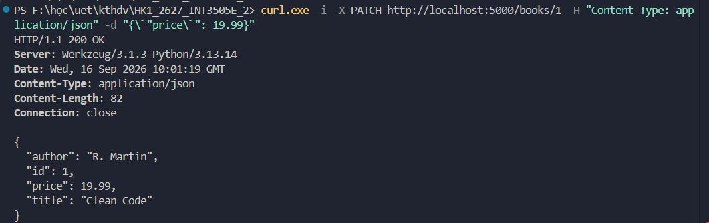
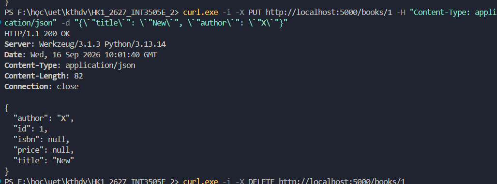
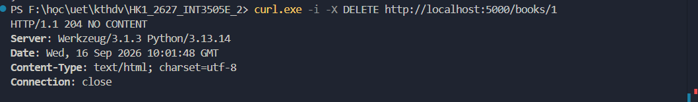
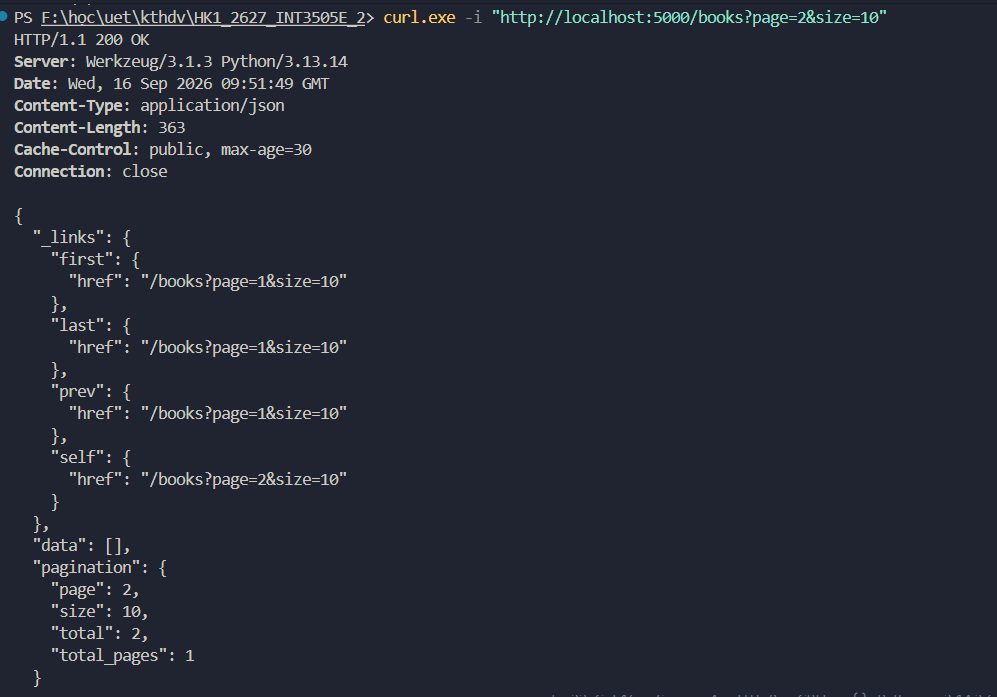
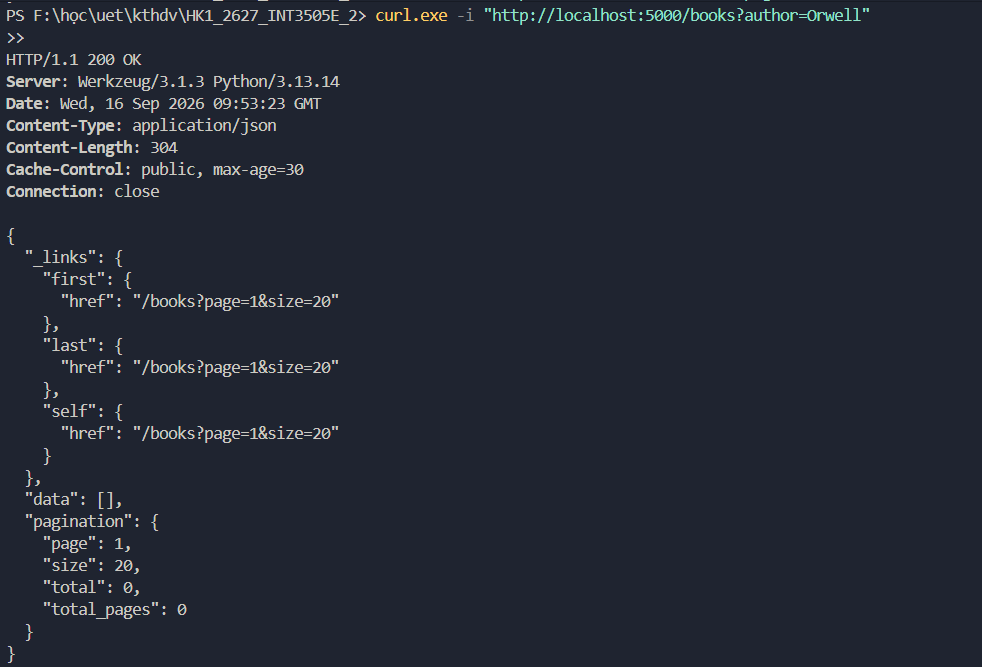
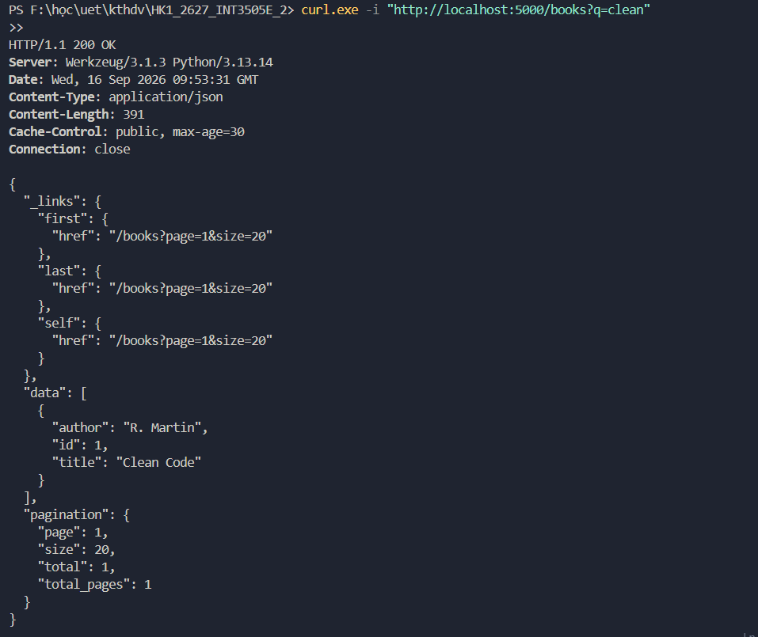

# Báo Cáo Thực Hành Tuần 2: Xây Dựng RESTful API với Flask

---

## Bài 1: Quản lý Sách Cơ Bản (GET & POST) — `w2-1.py`

Cung cấp các endpoint cơ bản để xem danh sách sách và thêm mới sách vào hệ thống.

### 1.1. Lấy danh sách toàn bộ sách (`GET /books`)
- **Mô tả**: Trả về danh sách tất cả các cuốn sách hiện có và tổng số lượng sách (`total`).
- **Lệnh test (PowerShell)**:
  ```powershell
  curl.exe -i "http://localhost:5000/books"
  ```
- **Kết quả minh chứng**:
  

### 1.2. Thêm sách mới (`POST /books`)
- **Mô tả**: Thêm cuốn sách mới với `title` và `author`. Trả về mã trạng thái `201 CREATED`, thông tin cuốn sách vừa tạo kèm header `Location: /books/{id}`.
- **Lệnh test (PowerShell)**:
  ```powershell
  curl.exe -i -X POST http://localhost:5000/books -H "Content-Type: application/json" -d "{\`"title\`": \`"Clean Code\`", \`"author\`": \`"R. Martin\`"}"
  ```
- **Kết quả minh chứng**:
  

---

## Bài 2: Cập Nhật và Xóa Sách (PATCH, PUT, DELETE) — `w2-2.py`

Hỗ trợ các thao tác sửa đổi từng phần, sửa đổi toàn bộ và xóa sách theo `id`.

### 2.1. Cập nhật một phần thông tin sách (`PATCH /books/<id>`)
- **Mô tả**: Chỉ cập nhật những trường được truyền lên (ví dụ cập nhật trường `price`), các trường khác giữ nguyên. Trả về `200 OK`.
- **Lệnh test (PowerShell)**:
  ```powershell
  curl.exe -i -X PATCH http://localhost:5000/books/1 -H "Content-Type: application/json" -d "{\`"price\`": 19.99}"
  ```
- **Kết quả minh chứng**:
  

### 2.2. Cập nhật toàn bộ thông tin sách (`PUT /books/<id>`)
- **Mô tả**: Thay thế toàn bộ dữ liệu của cuốn sách bằng dữ liệu mới. Trả về `200 OK`.
- **Lệnh test (PowerShell)**:
  ```powershell
  curl.exe -i -X PUT http://localhost:5000/books/1 -H "Content-Type: application/json" -d "{\`"title\`": \`"New\`", \`"author\`": \`"X\`"}"
  ```
- **Kết quả minh chứng**:
  

### 2.3. Xóa sách (`DELETE /books/<id>`)
- **Mô tả**: Xóa cuốn sách theo `id`. Khi thành công trả về mã trạng thái `204 NO CONTENT` (không có nội dung phản hồi).
- **Lệnh test (PowerShell)**:
  ```powershell
  curl.exe -i -X DELETE http://localhost:5000/books/1
  ```
- **Kết quả minh chứng**:
  

---

## Bài 3: Phân Trang, Tìm Kiếm, Lọc và HATEOAS — `w2-3.py`

Nâng cấp endpoint `GET /books` với các tính năng phân trang, lọc theo tác giả, tìm kiếm theo từ khóa và trả về siêu liên kết HATEOAS (`_links`).

### 3.1. Phân trang (`GET /books?page=...&size=...`)
- **Mô tả**: Phân trang dữ liệu với `page` và `size`. Trả về metadata phân trang (`pagination`) và các liên kết điều hướng (`_links`: `self`, `first`, `prev`, `next`, `last`).
- **Lệnh test (PowerShell)**:
  ```powershell
  curl.exe -i "http://localhost:5000/books?page=2&size=10"
  ```
- **Kết quả minh chứng**:
  

### 3.2. Lọc theo tác giả (`GET /books?author=...`)
- **Mô tả**: Lọc danh sách sách theo tên tác giả (`author`).
- **Lệnh test (PowerShell)**:
  ```powershell
  curl.exe -i "http://localhost:5000/books?author=Orwell"
  ```
- **Kết quả minh chứng**:
  

### 3.3. Tìm kiếm theo từ khóa tiêu đề (`GET /books?q=...`)
- **Mô tả**: Tìm kiếm gần đúng các cuốn sách có chứa từ khóa trong trường `title`.
- **Lệnh test (PowerShell)**:
  ```powershell
  curl.exe -i "http://localhost:5000/books?q=clean"
  ```
- **Kết quả minh chứng**:
  
