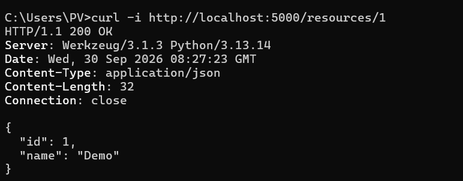
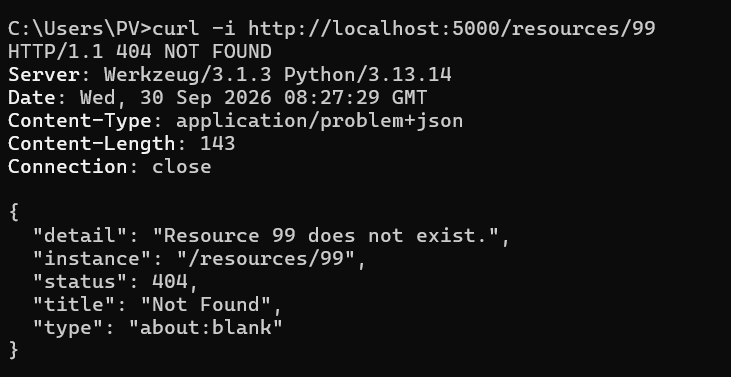
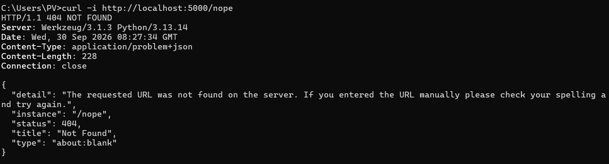
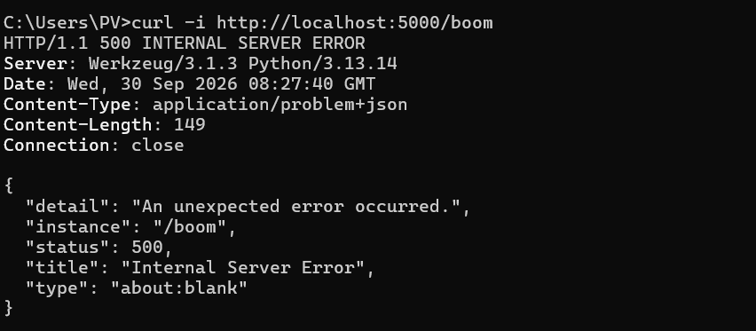
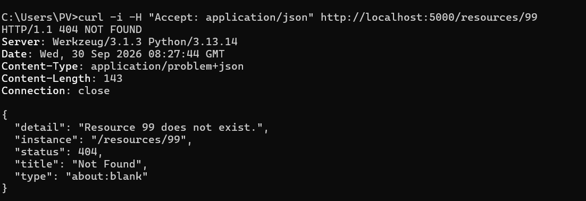
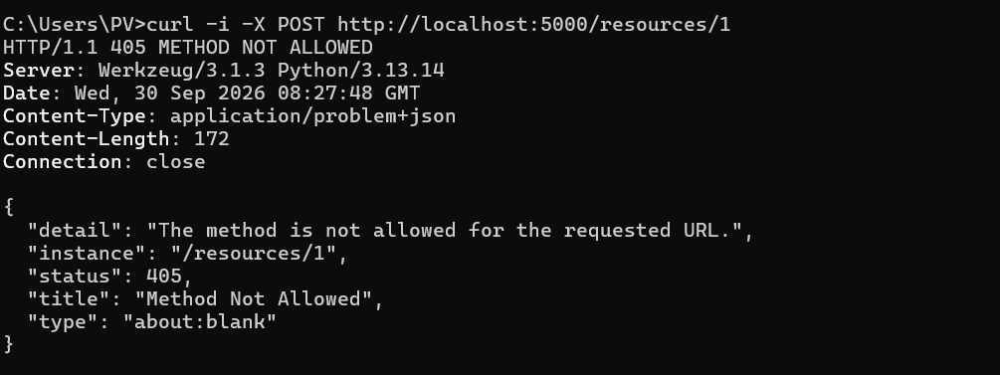

## Bài 1:
1. Các resources trong miền:
- Có 6 resources: users, profiles, posts, comments, tags, follow
2. Phân loại:
- Collection: /users, /posts, /tags, /follow
- Item: /users/<id>, /posts/<id>, /tags/{slugs}, /comments/<id>
- Sub-resources: /users/{id}/profile, /users/{id}/followers, /users/{id}/following

3. Endpoint tree:
```
/api/v1
├── /users                          GET, POST
│   └── /{id}                       GET, PATCH, DELETE
│       ├── /profile                GET, PUT
│       ├── /posts                  GET          
│       ├── /followers              GET
│       └── /following              GET
│           └── /{target_id}        PUT, DELETE  
├── /posts                          GET, POST  
│   └── /{id}                       GET, PATCH, DELETE
│       └── /comments               GET, POST
├── /comments/{id}                  GET, PATCH, DELETE
└── /tags                           GET
    └── /{slug}/posts               GET
```

## Bài 2:
Kiểm thử các trường hợp:
1. /resources/1 trả 200 và dữ liệu bình thường.

2. /resources/99 trả 404 kèm Content-Type: application/problem+json.

3. /nope trả 404 từ handler fallback.

4. /boom trả 500.

5. Khi có Accept: application/json, vẫn trả problem+json.

6.POST vào route chỉ có GET sẽ trả 405 Method Not Allowed dạng problem+json.
